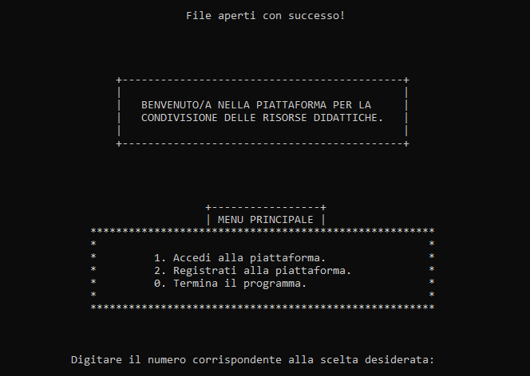
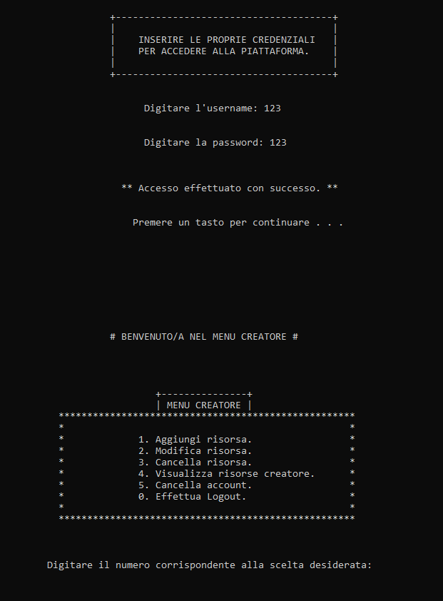
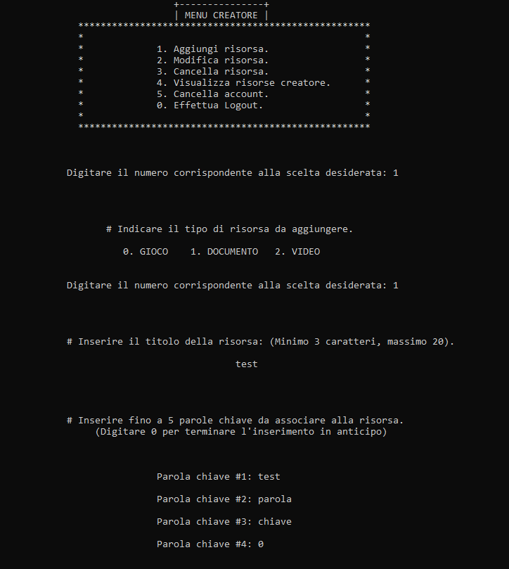
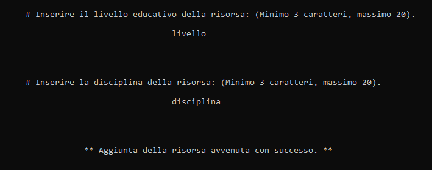
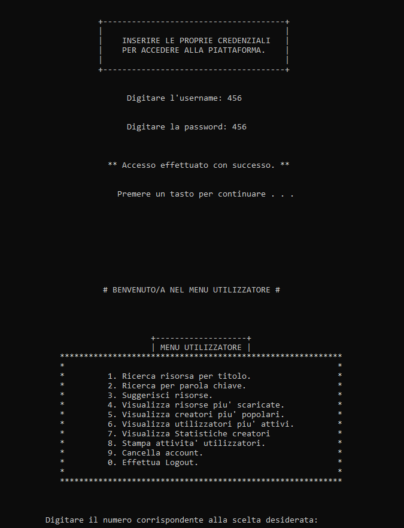
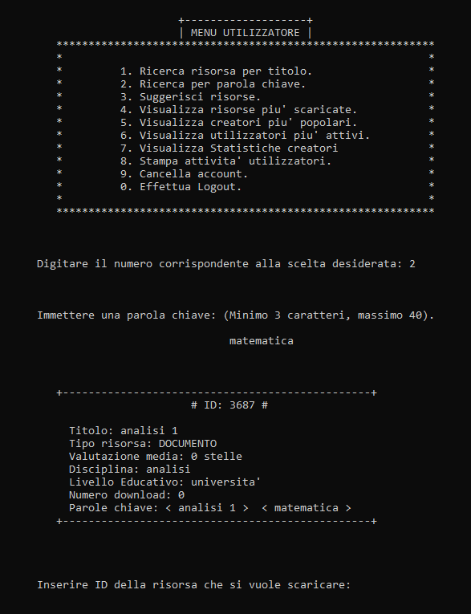
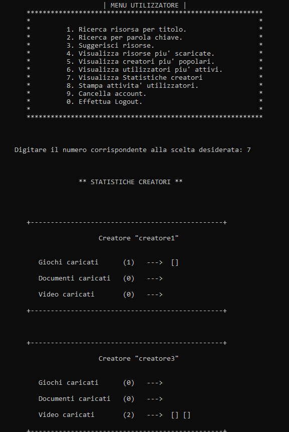
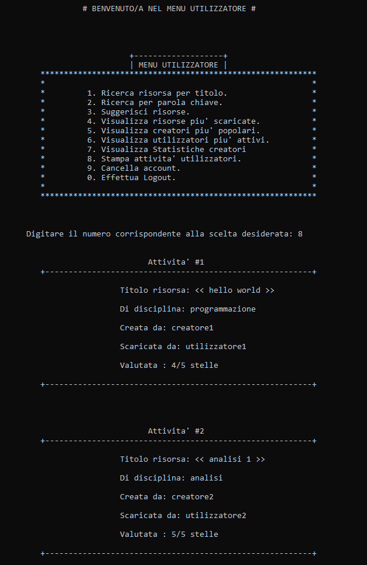

# Educational Platform Simulation – C Language

Project developed in **C** that simulates an educational platform for sharing learning resources (games, documents and videos), including management of users, resources, activities and statistics.

The system is implemented as a **console-based application** and uses **binary files** for data persistence.

This project was created as part of the **Computer Science Laboratory** course.

---

## Table of Contents

* [Project Description](#project-description)
* [Project Structure](#project-structure)
* [Screenshots of Main Features](#screenshots-of-main-features)
* [Main Features](#main-features)
* [Main Data Structures](#main-data-structures)
* [Data Persistence](#data-persistence)
* [Relevant Technical Aspects](#relevant-technical-aspects)
* [Compilation and Execution](#compilation-and-execution)
* [Testing](#testing)
* [Documentation](#documentation)
* [Final Notes](#final-notes)
* [License](#license)

---

## Project Description

The goal of the project is to simulate the main functionalities of an online educational resource sharing platform, supporting two types of users:

* **Creators**, who can upload and manage resources
* **Users**, who can search, download and rate resources

The system provides:

* user registration and authentication
* full resource management
* tracking of user activities
* automatic suggestions based on previous interactions
* visualization of statistics and rankings

The project was developed following a modular structure, with particular attention to **data design**, **file management**, and **input validation**.

---

## Project Structure

Each source file manages a specific functional area of the platform, separating data management, business logic and utility operations.

```
main.c
 └── Application entry point
     Handles menus, navigation and interaction flow

users.c / users.h
 └── User management
     Registration, login, authentication and account handling

resources.c / resources.h
 └── Resource management
     Creation, modification, deletion and visualization of educational resources

activity.c / activity.h
 └── Activity tracking
     Records user interactions (downloads, ratings and usage history)

sorting.c / sorting.h
 └── Ranking and statistics
     Sorting algorithms and generation of platform leaderboards

utility.c / utility.h
 └── Support functions
     Input validation, formatting and shared helper procedures

structs_macros.h
 └── Data definitions
     Structures, enumerations and symbolic constants used across the project

data-files/
 └── Binary data storage
     Persistent files containing users, resources and activity records

screenshots/
 └── Application interface examples
     Screens showing the main features of the system
```

This modular organization allows each component to be developed and maintained independently, improving readability and reducing coupling between different parts of the program.

---

## Screenshots of Main Features

### Login and Registration

<p align="center">
  
</p>

---

### Main Menu – Creator

<p align="center">
  
</p>

---

### Adding a Resource

<p align="center">
  
  
</p>

---

### Main Menu – User

<p align="center">
  
</p>

---

### Resource Search

<p align="center">
  
</p>

---

### Statistics and Rankings

<p align="center">
  
</p>

---

### User Activities

<p align="center">
  
</p>

---

## Main Features

### User Management

* Registration and login
* Distinction between *creator* and *user* accounts
* Account deletion
* Logout and return to the main menu

### Resource Management (Creators)

* Add new resources
* Modify uploaded resources
* Remove resources
* View resources associated with the account

### Search and Interaction (Users)

* Search resources by **title**
* Search resources by **keyword**
* Download and rate resources
* Automatic suggestion of related content

### Statistics and Rankings

* Top 5 most downloaded resources
* Top 5 most popular creators
* Top 5 most active users
* Creator statistics (number of resources per type)
* Visualization of user activities

---

## Main Data Structures

The project uses data structures defined through `struct` and `enum`, including:

* `user_t` – user management structure
* `resource_t` – educational resource structure
* `activity_t` – activity tracking structure
* `resource_type_t` – resource type enumeration (Game, Document, Video)

Symbolic constants are also used to improve readability and maintainability of the code.

---

## Data Persistence

Data persistence is handled through **binary files**, used as structured archives:

* `users.dat` – registered users
* `resources.dat` – resources on the platform
* `activity.dat` – user activities
* `ranking.dat` – support file for sorting operations

Data access is performed through direct positioning within the files using calculated identifiers.

---

## Relevant Technical Aspects

* Language: **C**
* Structured and modular programming
* Use of:

  * `struct`, `enum`, and pointers
  * binary files (`fread`, `fwrite`, `fseek`)
  * user input validation
* Deterministic identifier generation
* Sorting of persistent data
* Tracking interactions between users and resources

---

## Compilation and Execution

Compile using **MinGW (GCC for Windows):**

```bash
gcc *.c -o case-study
```

Run the program:

```bash
./case-study
```

Binary data files are automatically created at first execution if they are not present.

Sample data files are already included in the **data-files** folder, allowing immediate use of the application.

---

## Testing

The project was tested using a structured test plan covering:

* all main functionalities
* valid and invalid inputs
* edge cases

The tests confirmed the correct functioning of the system according to the defined requirements.

---

## Documentation

The complete project documentation is available in PDF format at the following link:

📄 [Case Study Documentation (PDF)](https://github.com/Enzo-94-prog/case-study/blob/main/docs/platform-c-simulation-documentation.pdf?raw=1)

---

## Final Notes

This project represents a complete case study demonstrating skills in:

* software design
* memory and file management in C
* requirements analysis
* development of structured console applications

Although developed in an academic context, the project was built following an approach close to real software development environments.

---
## License
This project is licensed under the MIT License - see the LICENSE file for details.
