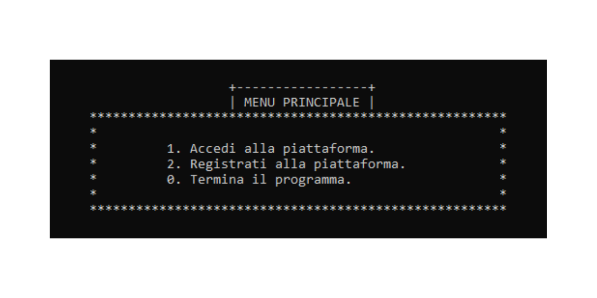

# Educational Platform Simulation (C Case Study)

A console-based application written in **C** that simulates an educational platform for sharing learning resources (games, documents and videos).



The project focuses on **low-level programming**, modular software structure and persistent data management using binary files.

---

## Quick Start (Build and Run)

### Requirements

* C compiler (GCC or Clang)
* Developed and tested on Windows using MinGW
* Compatible with Linux/macOS environments (GCC usually available by default)

### Before you compile

Sample binary data files are included in the repository to allow immediate testing of the application.

To use the preloaded users and resources, move the files contained in the **data-files** folder directly into the **root of the repository** (the same directory where `main.c` is located) before running the program.

If you do not move these files, the program will still run correctly: at startup it automatically creates the required binary files, but you will need to manually create users and resources.

### Compile

```bash
gcc *.c -o case-study
```

### Run

```bash
./case-study
```

The application will start in the terminal and display the interactive menu.

---

## Sample Credentials (Preloaded)

### Creator account

* username: `creatore1`
* password: `creatore1`

### User account

* username: `utilizzatore1`
* password: `utilizzatore1`

### Example preloaded resource

* type: `gioco`
* title: `hello world`
* creator: `creatore1`
* keywords: `hello world`, `gioco`
* level: `universita'`
* discipline: `programmazione`

---

## Project Overview

This project is not a simple exercise program.

It reproduces the core logic of a small platform where users can upload, search and interact with educational resources.
The goal was to practice structured programming, modular design and persistent data handling without using external libraries or databases.

The system supports two user roles:

* **Creators** → upload and manage resources
* **Users** → search, download and rate resources

---

## Main Features

* User registration and login
* Creator and user roles
* Resource upload, modification and deletion
* Search by title and keywords
* Activity tracking (downloads and ratings)
* Automatic suggestions based on interactions
* Statistics and rankings

---

## Technologies Used

* **C (ISO C)** — core programming language
* Structured and modular programming
* Binary files for persistent storage

No external libraries or databases were used.

---

## What I Learned

During this project I improved my ability to:

* design a modular software architecture
* manage memory structures using `struct` and pointers
* implement file persistence using binary files
* validate user input
* handle program flow in an interactive application

---

# Technical Documentation

## Key Files to Review

To quickly understand the core logic, start from these files:

* Program flow and menus → [main.c](main.c)
* User management → [users.c](users.c)
* Resource management → [resources.c](resources.c)
* Activity tracking → [activity.c](activity.c)
* Statistics and sorting → [sorting.c](sorting.c)

---

## Data Persistence

The application stores data inside binary files, simulating a simple database:

* `users.dat` → registered users
* `resources.dat` → available resources
* `activity.dat` → tracked interactions
* `ranking.dat` → statistics support file

The program reads and writes records using `fread`, `fwrite` and `fseek`.

---

## Program Architecture

The project follows a modular structure where each module manages a specific area of the system:

* user authentication
* resource management
* activity logging
* ranking and statistics

Shared data structures are defined in `structs_macros.h` and used across modules.

---

## Project Structure

```text
case-study/
│
├── main.c
├── users.c / users.h
├── resources.c / resources.h
├── activity.c / activity.h
├── sorting.c / sorting.h
├── utility.c / utility.h
|
├── structs_macros.h
│
├── data-files/
│   └── binary persistent storage
|
|── docs/
|   └── assignment
|   └── platform-c-simulation-documentation
|
├── preview/
│   └── social_preview.png
|
└── screenshots/
    └── terminal interface previews
```

---

## Design Choices

**Binary file persistence**
Instead of using a database, the project uses binary files as structured archives.

**Modular programming**
Each module handles a specific responsibility, reducing coupling and improving readability.

**Console interface**
The text interface focuses attention on logic and data management rather than graphical design.

---

## Roadmap (Possible Improvements)

* replace `scanf`-based input with buffered input (`fgets` + parsing) to prevent invalid input and input skipping
* make title and keyword search case-insensitive for more reliable results
* create a temporary backup file before overwriting binary data to reduce risk of corruption on unexpected termination
* paginate long menu lists (users/resources) to improve readability in the terminal

---

## Author

Enzo Marcone — Information Technology for Digital Companies graduate interested in software development and systems programming.

---

## License

This project is licensed under the MIT License.
See the `LICENSE` file for details.
